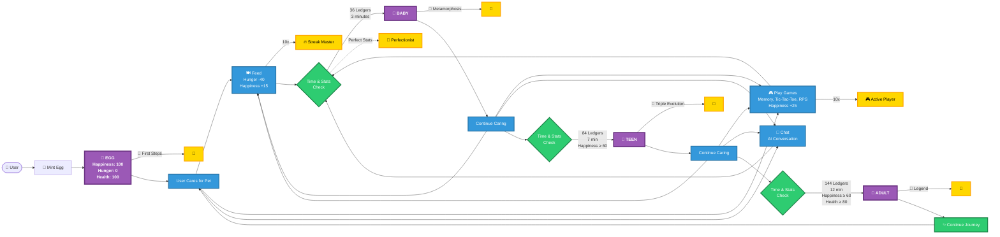

# Pet World - Complete Flow (PPT Version)

```mermaid
flowchart LR
    Start([👤 User]) --> Mint[🥚 Mint Egg]
    
    Mint --> Egg[🥚 EGG<br/>Happiness: 100<br/>Hunger: 0<br/>Health: 100]
    Egg -->|🥚 First Steps| A1[🎯]
    
    Egg --> Actions[User Cares for Pet]
    
    Actions --> Feed[🍽️ Feed<br/>Hunger -40<br/>Happiness +15]
    Actions --> Play[🎮 Play Games<br/>Memory, Tic-Tac-Toe, RPS<br/>Happiness +25]
    Actions --> Chat[💬 Chat<br/>AI Conversation]
    
    Feed -->|10x| A5[🔥 Streak Master]
    Play -->|10x| A6[🎮 Active Player]
    
    Feed --> Evolve1{Time & Stats<br/>Check}
    Play --> Evolve1
    Chat --> Evolve1
    
    Evolve1 -->|36 Ledgers<br/>3 minutes| Baby[🐣 BABY]
    Baby -->|🦋 Metamorphosis| A2[🎯]
    
    Baby --> Actions2[Continue Caring]
    Actions2 --> Feed
    Actions2 --> Play
    Actions2 --> Chat
    
    Actions2 --> Evolve2{Time & Stats<br/>Check}
    Evolve2 -->|84 Ledgers<br/>7 min<br/>Happiness ≥ 60| Teen[🦖 TEEN]
    Teen -->|🌟 Triple Evolution| A3[🎯]
    
    Teen --> Actions3[Continue Caring]
    Actions3 --> Feed
    Actions3 --> Play
    Actions3 --> Chat
    
    Actions3 --> Evolve3{Time & Stats<br/>Check}
    Evolve3 -->|144 Ledgers<br/>12 min<br/>Happiness ≥ 60<br/>Health ≥ 80| Adult[🐲 ADULT]
    Adult -->|👑 Legend| A4[🎯]
    
    Evolve1 -.->|Perfect Stats| A7[💯 Perfectionist]
    
    Adult --> Loop[✨ Continue Journey]
    Loop --> Actions
    
    %% Styling
    classDef stage fill:#9B59B6,stroke:#6C3483,stroke-width:4px,color:#fff,font-weight:bold
    classDef action fill:#3498DB,stroke:#2874A6,stroke-width:3px,color:#fff
    classDef achievement fill:#FFD700,stroke:#FFA500,stroke-width:3px,color:#000
    classDef check fill:#2ECC71,stroke:#1E8449,stroke-width:3px,color:#fff
    
    class Egg,Baby,Teen,Adult stage
    class Feed,Play,Chat,Actions,Actions2,Actions3 action
    class A1,A2,A3,A4,A5,A6,A7 achievement
    class Evolve1,Evolve2,Evolve3,Loop check
```

